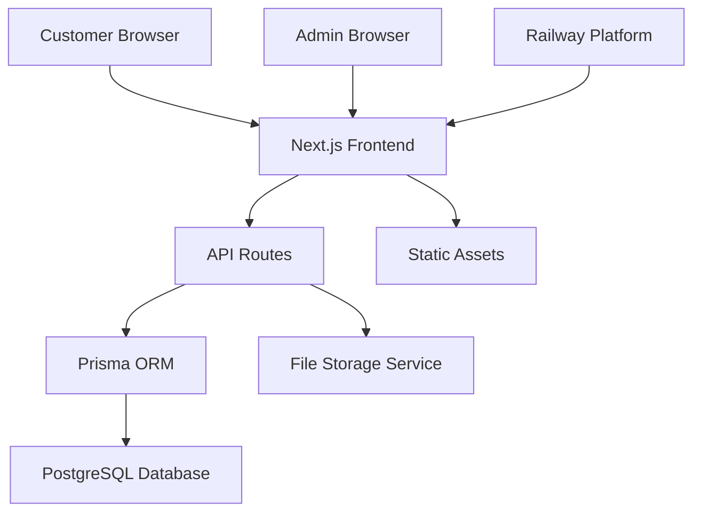

# Design Document

## Overview

The product catalog website will be built as a modern web application using Next.js with TypeScript, featuring a clean Apple-inspired design using Shad CN UI components. The architecture follows a full-stack approach with server-side rendering for optimal performance and SEO, integrated with a database for product management and deployed to Railway.

## Architecture

### Technology Stack
- **Frontend**: Next.js 14 with App Router, TypeScript, Tailwind CSS
- **UI Components**: Shad CN UI for consistent, minimalistic design
- **Database**: PostgreSQL (Railway-hosted)
- **ORM**: Prisma for type-safe database operations
- **Authentication**: NextAuth.js for admin authentication
- **File Storage**: Railway's built-in file storage or Cloudinary for images
- **Deployment**: Railway with automatic deployments

### System Architecture


## Components and Interfaces

### Frontend Components

#### Public Pages
1. **Homepage Component**
   - Hero section with featured products
   - Category navigation
   - Product grid with featured items
   - Clean, Apple-style layout with generous white space

2. **Product Catalog Component**
   - Category filter sidebar
   - Product grid with pagination
   - Search functionality
   - Responsive card layout

3. **Product Detail Component**
   - Image gallery with main image and thumbnails
   - Product information panel
   - Contact CTA button
   - Related products section

4. **Contact Page Component**
   - Contact form with validation
   - Company information
   - Success/error message handling

#### Admin Components
1. **Admin Dashboard**
   - Overview statistics
   - Quick actions for product management
   - Navigation to product and category management

2. **Product Management**
   - Product list with search and filters
   - Add/Edit product form with image upload
   - Delete confirmation modals

3. **Category Management**
   - Category list and CRUD operations
   - Category assignment interface

### API Interfaces

#### Public API Endpoints
- `GET /api/products` - Fetch products with optional category filter
- `GET /api/products/[id]` - Fetch single product details
- `GET /api/categories` - Fetch all categories
- `POST /api/contact` - Submit contact form

#### Admin API Endpoints
- `POST /api/admin/products` - Create new product
- `PUT /api/admin/products/[id]` - Update product
- `DELETE /api/admin/products/[id]` - Delete product
- `POST /api/admin/categories` - Create category
- `PUT /api/admin/categories/[id]` - Update category
- `DELETE /api/admin/categories/[id]` - Delete category
- `POST /api/admin/upload` - Handle image uploads

## Data Models

### Product Model
```typescript
interface Product {
  id: string
  name: string
  description: string
  price: number
  mainImage: string
  galleryImages: string[]
  categoryId: string
  category: Category
  featured: boolean
  active: boolean
  createdAt: Date
  updatedAt: Date
}
```

### Category Model
```typescript
interface Category {
  id: string
  name: string
  description?: string
  products: Product[]
  createdAt: Date
  updatedAt: Date
}
```

### Contact Inquiry Model
```typescript
interface ContactInquiry {
  id: string
  name: string
  email: string
  message: string
  productId?: string
  product?: Product
  createdAt: Date
}
```

### Admin User Model
```typescript
interface AdminUser {
  id: string
  email: string
  name: string
  hashedPassword: string
  createdAt: Date
  updatedAt: Date
}
```

## Error Handling

### Client-Side Error Handling
- Form validation with real-time feedback using React Hook Form and Zod
- Network error handling with retry mechanisms
- Loading states and error boundaries for graceful degradation
- Toast notifications for user feedback

### Server-Side Error Handling
- API route error handling with proper HTTP status codes
- Database connection error handling
- File upload error handling with size and type validation
- Authentication error handling with proper redirects

### Error Logging
- Server-side error logging for debugging
- Client-side error reporting for production issues

## Testing Strategy

### Unit Testing
- Component testing with React Testing Library
- API route testing with Jest
- Database model testing with Prisma test environment
- Utility function testing

### Integration Testing
- End-to-end testing with Playwright
- API integration testing
- Database integration testing
- File upload testing

### Manual Testing
- Cross-browser compatibility testing
- Mobile responsiveness testing
- Admin workflow testing
- Performance testing

## Security Considerations

### Authentication & Authorization
- Secure admin authentication with NextAuth.js
- Protected API routes for admin operations
- Session management and CSRF protection

### Data Validation
- Input validation on both client and server
- SQL injection prevention through Prisma ORM
- File upload validation and sanitization

### Deployment Security
- Environment variable management
- HTTPS enforcement
- Database connection security

## Performance Optimization

### Frontend Performance
- Next.js Image component for optimized image loading
- Static generation for product pages where possible
- Code splitting and lazy loading
- Caching strategies for API responses

### Database Performance
- Proper indexing on frequently queried fields
- Optimized queries with Prisma
- Connection pooling

### Deployment Performance
- Railway's CDN for static assets
- Gzip compression
- Proper caching headers

## Design System

### Visual Design Principles
- Minimalistic Apple-inspired aesthetic
- Generous white space and clean typography
- Consistent spacing using Tailwind's spacing scale
- Subtle shadows and rounded corners
- High-quality product imagery as focal points

### Color Palette
- Primary: Clean whites and light grays
- Accent: Subtle blue or black for CTAs
- Text: Dark gray for readability
- Success/Error: Standard green/red with good contrast

### Typography
- Clean, modern sans-serif fonts
- Consistent hierarchy with proper sizing
- Adequate line spacing for readability

### Component Consistency
- Shad CN UI components for consistent styling
- Custom variants for brand-specific needs
- Responsive design patterns throughout